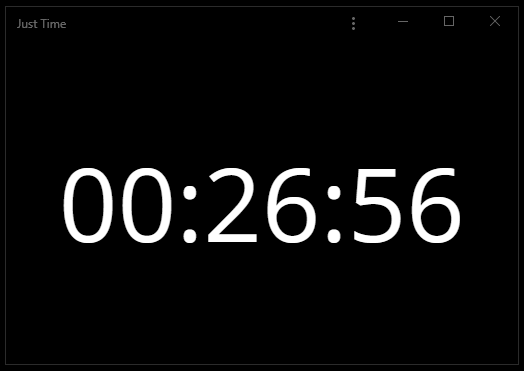

# Just Time

See current time in HH:MM:SS format. [https://just-time.eu/](https://just-time.eu/)

Or without seconds in HH:MM format. [https://just-time.eu/?hideSeconds](https://just-time.eu/?hideSeconds)
